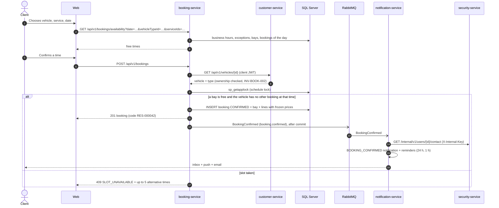

# Sequence — Book a wash (RF-005, RF-006)

```mermaid
sequenceDiagram
    autonumber
    actor C as Client
    participant W as Web
    participant B as booking-service
    participant CU as customer-service
    participant DB as SQL Server
    participant MQ as RabbitMQ
    participant N as notification-service
    participant S as security-service

    C->>W: Chooses vehicle, service, date
    W->>B: GET /api/v1/bookings/availability?date=…&vehicleTypeId=…&serviceIds=…
    B->>DB: business hours, exceptions, bays, bookings of the day
    B-->>W: free times
    C->>W: Confirms a time
    W->>B: POST /api/v1/bookings
    B->>CU: GET /api/v1/vehicles/{id} (client JWT)
    CU-->>B: vehicle + type (ownership checked, INV-BOOK-002)
    B->>DB: sp_getapplock (schedule lock)
    alt a bay is free and the vehicle has no other booking at that time
        B->>DB: INSERT booking CONFIRMED + bay + lines with frozen prices
        B-->>W: 201 booking (code RES-000042)
        B-)MQ: BookingConfirmed (booking.confirmed), after commit
        MQ-)N: BookingConfirmed
        N->>S: GET /internal/v1/users/{id}/contact (X-Internal-Key)
        N->>N: BOOKING_CONFIRMED notification + reminders (24 h, 1 h)
        N-->>C: inbox + push + email
    else slot taken
        B-->>W: 409 SLOT_UNAVAILABLE + up to 5 alternative times
    end
```

The availability call's exact parameters are in `07-api/contracts/openapi/booking-service.yaml`.
