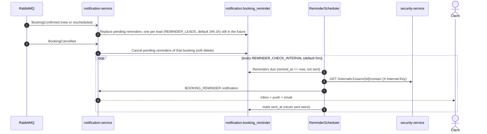

# Sequence — Booking reminder (ADR-011 §7)

```mermaid
sequenceDiagram
    autonumber
    participant MQ as RabbitMQ
    participant N as notification-service
    participant DB as notification.booking_reminder
    participant J as ReminderScheduler
    participant S as security-service
    actor C as Client

    MQ-)N: BookingConfirmed (new or rescheduled)
    N->>DB: Replace pending reminders: one per lead (REMINDER_LEADS, default 24h,1h) still in the future
    MQ-)N: BookingCancelled
    N->>DB: Cancel pending reminders of that booking (soft delete)
    loop every REMINDER_CHECK_INTERVAL (default 5m)
        J->>DB: Reminders due (remind_at <= now, not sent)
        J->>S: GET /internal/v1/users/{id}/contact (X-Internal-Key)
        J->>N: BOOKING_REMINDER notification
        N-->>C: inbox + push + email
        J->>DB: mark sent_at (never sent twice)
    end
```
